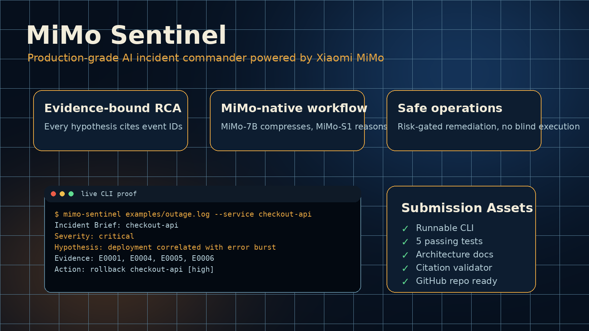

# MiMo Sentinel



> Autonomous AI incident commander powered by Xiaomi MiMo for log intelligence, root-cause analysis, and safe remediation planning.

[](https://www.python.org/downloads/)
[](https://100t.xiaomimimo.com)
[](LICENSE)

## Overview

MiMo Sentinel turns noisy production telemetry into concise incident briefs and ranked remediation plans. It is designed for on-call teams that need fast triage without handing destructive control to an agent.

The system uses MiMo in three places:

- **Signal compression**: condenses thousands of log lines into a structured timeline.
- **Root-cause reasoning**: compares symptoms, deploy notes, and service topology.
- **Remediation planning**: proposes safe, reversible actions with confidence scores.

## Why This Matters

Modern services produce too much telemetry for humans to parse during an incident. Most alerting systems say that something broke, but not why. MiMo Sentinel uses long-context reasoning to connect events across services while keeping final actions human-approved.

## Architecture

```text
logs / metrics / deploy notes
          |
          v
+-------------------+      +------------------+
| Signal Ingestor   | ---> | Timeline Builder |
+-------------------+      +------------------+
          |                         |
          v                         v
+-------------------+      +------------------+
| MiMo RCA Agent    | ---> | Remediation Plan |
+-------------------+      +------------------+
          |                         |
          v                         v
+-------------------+      +------------------+
| Risk Gate         | ---> | Incident Brief   |
+-------------------+      +------------------+
```

## Features

- Parse raw logs, JSONL events, or mixed incident notes.
- Detect error bursts, deploy correlation, and service-level blast radius.
- Produce ranked hypotheses with supporting evidence.
- Build evidence-bound MiMo prompts with strict JSON schema hints.
- Validate hypothesis citations so unknown event IDs are rejected.
- Generate safe runbook-style remediation plans.
- Block risky commands unless explicitly approved.
- Run fully offline with a deterministic heuristic engine, or connect to MiMo API for deeper reasoning.

## Quick Start

```bash
python -m venv .venv
source .venv/bin/activate
pip install -e .

mimo-sentinel analyze examples/outage.log --service checkout-api
```

With MiMo API:

```bash
export MIMO_API_KEY="your-key-here"
mimo-sentinel analyze examples/outage.log --service checkout-api --use-mimo
```

## Example Output

```text
Incident: checkout-api elevated 5xx
Severity: high
Likely cause: database connection pool exhaustion after deploy 2026.05.22-rc3
Confidence: 0.84

Evidence:
- 5xx rate starts 2 minutes after deploy marker
- repeated `pool timeout` errors from checkout-api
- payment-worker remains healthy, limiting blast radius

Recommended actions:
1. Roll back checkout-api to previous image tag
2. Increase DB pool max from 20 to 40 only if rollback is blocked
3. Keep payment-worker unchanged
```

## Project Structure

```text
mimo-sentinel/
├── src/mimo_sentinel/
│   ├── cli.py              # Command line entrypoint
│   ├── models.py           # Typed incident data models
│   ├── parser.py           # Log parsing and event normalization
│   ├── analyzer.py         # Heuristic + MiMo reasoning pipeline
│   ├── mimo_client.py      # MiMo API adapter
│   ├── risk.py             # Safety gate for remediation actions
│   └── report.py           # Human-readable report rendering
├── examples/outage.log
├── tests/
└── pyproject.toml
```

## MiMo Integration Design

MiMo Sentinel does not hard-code a single model. The adapter supports:

- `mimo-s1` for deep root-cause reasoning.
- `mimo-7b` for low-latency log summarization.
- offline fallback for demos and CI.

The MiMo prompt is intentionally evidence-bound: it receives normalized events and must cite event IDs for every hypothesis. This reduces hallucinated RCA narratives and makes the report auditable.

## Safety Model

The tool never runs production commands. It emits runbook steps with a risk level:

- `low`: read-only checks and dashboards.
- `medium`: reversible config or scaling changes.
- `high`: rollbacks, restarts, traffic shifts.
- `blocked`: destructive operations such as data deletion.

## License

MIT
